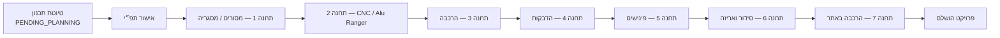

# SkyFlow — מצגת מערכת ביצוע מפעל

**מוצר:** SkyFlow (Skykon)  
**תחום:** ניהול וביצוע ייצור חלונות / אלומיניום / פלדה — משלב התכנון (תפ״י) ועד הרכבה באתר  
**ארכיטקטורה:** אפליקציית Web (Angular) + API (NestJS) + PostgreSQL (Prisma)

---

## תוכן עניינים

1. [יכולות המערכת](#1-יכולות-המערכת)
2. [פיצ׳רים לפי תחום](#2-פיצרים-לפי-תחום)
3. [ערך לארגון — לפני ואחרי](#3-ערך-לארגון--לפני-ואחרי)
4. [אבטחה — מצב נוכחי ורמת יעד מקסימלית](#4-אבטחה--מצב-נוכחי-ורמת-יעד-מקסימלית)
5. [מכשירים: טאבלט, דסקטופ, מובייל](#5-מכשירים-טאבלט-דסקטופ-מובייל)

---

## 1. יכולות המערכת

SkyFlow היא **מערכת ביצוע דיגיטלית end-to-end** לקו ייצור מפעלי, שמחברת בין:

| שכבה | מה המערכת עושה |
|------|----------------|
| **תכנון (תפ״י)** | קליטת Excel/CSV, ניתוח BOM, תצוגה מקדימה, אישור והעברה לייצור |
| **7 תחנות ייצור** | מסך עבודה ייעודי לכל עמדה — דיווח כמויות, פחת, תמונות, צ׳קליסטים |
| **שרשרת נעילה** | תחנה נפתחת רק כשהתנאים מהתחנות הקודמות מתקיימים (כולל כללי מעבר מיוחדים) |
| **ניהול** | לוח בקרה, פרויקטים חיים, פחת, משתמשים, סימולציה, קבצים, ייצוא |
| **משלוח והרכבה באתר** | מעקב אריזה → מוכן למשלוח → תעודת משלוח → הרכבה באתר |

### זרימת פרויקט (מאקרו)



### יכולות ליבה (בולטים למצגת)

- **קליטת תכנון אוטומטית** — פרסור קובץ תפ״י, יחידות TYPE, חלונות, רכיבי BOM, תמונות מוטמעות מהגליון
- **יצירת שורות עבודה למסורים** — רק פרופילי MPS-X/Y ו-MPB-X/Y X2, כולל אורכי חיתוך ותמונות לפי עמודה
- **וריאנטים לפי סוג פרויקט** — אלומיניום ↔ מסורים, פלדה ↔ מסגריה; זכוכית ↔ CNC, Alu Ranger ↔ תחנה 2 חלופית
- **דיווח בזמן אמת** — כל דיווח נשמר ב-`StationLog` / `ScrapReport` עם מזהה עובד וחותמת זמן
- **מעקב פחת מדויק** — לפי פרופיל קטלוגי (MPS/MPB) או פרופיל מצויר; חישוב אורך במ״מ
- **תיעוד ויזואלי** — תמונות הרכבה (תחנה 3), אריזה (תחנה 6), תעודת משלוח PDF (תחנה 7)
- **הרשאות מבוססות תפקיד** — עובד, מנהל תחנה, מנהל אתר, תכנון, מנהל מערכת
- **רב-לשוני** — עברית, ערבית, אנגלית + RTL/LTR
- **מצב בהיר / כהה** — מותאם לסביבת מפעל ומשרד

---

## 2. פיצ׳רים לפי תחום

### 2.1 תפקידים במערכת

| תפקיד | גישה עיקרית |
|--------|-------------|
| **WORKER** | מרכז עמדות + מסוף עבודה לתחנות 1–6 |
| **STATION_MANAGER** | כמו עובד + שיוך לעמדה מנוהלת (`managedStationId`) |
| **SITE_MANAGER** | הרכבה באתר (תחנה 7) — דיווח מוגבל לתפקיד זה ב-API |
| **PLANNING** | פרויקט חדש, טיוטות, אישור תפ״י, רשימת פרויקטים |
| **ADMIN** | לוח בקרה מלא, משתמשים, פחת, סימולציה, קבצים, הגדרות |

### 2.2 מודול תכנון (תפ״י)

- **אשף 3 שלבים:** שם פרויקט → העלאת קובץ → שיבוץ מנהל/עובדים + אישור
- **טיוטות תכנון** — המשך עבודה מנקודה שנשמרה (עם/בלי קובץ)
- **בחירת קו ייצור:** חומר (אלומיניום / פלדה) + מסלול עיבוד (זכוכית / Alu Ranger)
- **תצוגה מקדימה:** סיכום לפי גליונות Excel, רכיבים, תמונות מוטמעות
- **ייצוא PDF** של דוח התכנון להדפסה / שיתוף
- **מסמכי פרויקט:** הזמנות רכש (PO) ופקודות עבודה (WO) כ-PDF
- **שליחת מסמכים במייל** (מנהל בלבד)

לאחר **אישור תפ״י** (`flowStatus: IN_PRODUCTION`):
- נוצרות שורות `SawStationWorkLine` לתחנת 1
- רק תחנה 1 נפתחת; שאר התחנות לפי שרשרת הנעילה

### 2.3 שבע תחנות ייצור

| # | שם (ברירת מחדל) | וריאנט | יכולות עיקריות |
|---|------------------|--------|----------------|
| **1** | מסורים | **מסגריה** (פלדה) | דיווח לפי TYPE, כמות קורות לניסור, מטרים לחיתוך, פחת לפי פרופיל MPS/MPB, צוות משובץ מתכנון |
| **2** | CNC | **Alu Ranger** | דיווח עיבוד; נפתח אחרי דיווח ראשון במסורים (לא חייב 100%) |
| **3** | הרכבה | — | יחידות וחלונות, דיווח כמות הרכבה, תמונה לפי TYPE, גרוטאות ידניות |
| **4** | הדבקות | — | מעקב לפי סוגי יחידות, סימון «בוצע», פחת |
| **5** | פינישים | — | צ׳קליסט אימות שלבים קודמים לפני סיום |
| **6** | סידור ואריזה | — | תמונות תיעוד לפי slots, אחוז התקדמות, «מוכן למשלוח» |
| **7** | הרכבה באתר | — | העלאת תעודת משלוח, יעדים (קורות / זיגוג / יוניטייז), דיווח הרכבה — **SITE_MANAGER בלבד** |

**נעילת תחנות:** מסך Hub מציג תחנות נעולות; `stationSequenceGuard` חוסם קישור ישיר לתחנה שלא עומדת בתנאי השרשרת.

### 2.4 לוח ניהול (Admin)

| מסך | פיצ׳רים |
|-----|---------|
| **לוח בקרה** | KPI: פרויקטים פעילים, הזמנות, פחת, רישומי עמדות; גרפים: קצב יומי, עומס לפי תחנה, צווארי בקבוק, סטטוס הזמנות; קרוסלת «תצוגה חיה»; **ייצוא Excel (CSV/XLSX)** מרובה גליונות |
| **פרויקטים** | רשימה, פירוט התקדמות לפי תחנה, פחת לפרויקט, קישור לתצוגה חיה / מפת תחנות |
| **תצוגה חיה** | מעקב פרויקט בביצוע בזמן אמת |
| **פחת** | ניתוח פחת ברמת מפעל ופרויקט (מ״מ, פרופילים) |
| **משתמשים** | יצירה, עריכה, תפקיד, שיוך לעמדה, תמונת פרופיל |
| **סימולציית הזמנה** | חישוב צריכת חומר מול מאגר פחת חי — לתכנון רכש |
| **קבצים** | ניהול מסמכים ושליחה לעובדים |
| **הגדרות** | העדפות ממשק (שפה, ערכת נושא) |

### 2.5 מסוף עובד (Worker)

- **מרכז עמדות** — בחירת פרויקט + כרטיס לכל תחנה (סטטוס, אחוז, נעילה)
- **מסוף תחנה** — UI מותאם מגע (`touch`), טבעות התקדמות, מודאלים לדיווח
- **יומן פעילות** — היסטוריית דיווחים לפרויקט בתחנה
- **התראת סיום תחנה** — Toast לאחר דיווח מוצלח
- **בחירת פרויקט גלובלית** — שמירת הזמנה נוכחית בין תחנות

### 2.6 תשתית טכנית (לשקופית «איך זה בנוי»)

| רכיב | טכנולוגיה |
|------|-----------|
| Frontend | Angular 21, Tailwind-utility classes, ngx-translate, Chart.js |
| Backend | NestJS, Passport JWT, class-validator DTOs |
| DB | PostgreSQL + Prisma ORM |
| אימות | JWT Bearer על כל ה-API (מלבד login ו-health) |
| קבצים | העלאה מבוקרת (סוג MIME, גודל מקסימלי, שמות קבצים מסוננים) |

---

## 3. ערך לארגון — לפני ואחרי

### המצב לפני SkyFlow (טיפוסי למפעל ללא מערכת)

| אתגר | השפעה |
|------|--------|
| תכנון ב-Excel / נייר | טעויות העתקה, גרסאות לא מסונכרנות |
| דיווח בעמדה בוואטסאפ / דף | אין תמונה אחת של התקדמות |
| פחת «בראש» | בזבוז חומר, קושי בתכנון רכש |
| אין שרשרת ברורה | תחנה מתחילה לפני שהקודמת סיימה |
| מנהלים שואלים «איפה הפרויקט?» | זמן יקר, החלטות מאוחרות |
| הרכבה באתר נפרדת | פער בין מה שיצא מהמפעל למה שהגיע לאתר |

### מה SkyFlow נותן — תועלת מדידה

| תועלת | איך זה מתבטא במערכת |
|--------|---------------------|
| **מקור אמת אחד** | פרויקט אחד ב-DB — מתכנון עד סגירה |
| **קיצור זמן קליטה** | העלאת תפ״י → שורות מסורים אוטומטיות + תמונות |
| **שקיפות בזמן אמת** | לוח בקרה + תצוגה חיה + אחוזים לכל תחנה |
| **אחריות ועקיבות** | כל דיווח עם `workerId` ו-`createdAt` |
| **ניהול פחת מבוסס נתונים** | דיווח במסורים + עמוד פחת + סימולציית הזמנה |
| **מניעת דילוגים בתהליך** | נעילת תחנות + אימות פינישים |
| **תיעוד ללקוח / ביקורת** | תמונות הרכבה ואריזה, PDF תכנון, תעודת משלוח |
| **התאמה לצוות מגוון** | עברית / ערבית / אנגלית על רצפת ייצור |
| **הכנה לגדילה** | תפקידים, שיבוץ עובדים, ייצוא נתונים ל-ERP בעתיד |

### משפט מפתח למצגת

> **SkyFlow הופכת את קובץ התכנון והדיווח בשטח לנתונים חיים** — כך שמנהל ייצור, תכנון ורכש רואים את אותה תמונה, בלי לרדוף אחרי אנשים.

### ROI אפשרי לציין (ללא מספרים — לפי שיחה עם הלקוח)

- הפחתת פחת חומר (%)
- זמן תגובה לצוואר בקבוק (שעות → דקות)
- הפחתת טעויות «תחנה לא מוכנה»
- זמן אישור תפ״י → פתיחת מסורים

---

## 4. אבטחה — מצב נוכחי ורמת יעד מקסימלית

### 4.1 מה כבר מיושם בפרויקט (מדויק לקוד)

| מנגנון | פירוט |
|--------|--------|
| **אימות JWT** | `JwtAuthGuard` גלובלי; רק `@Public()` ל-login, health, נכסי תכנון סטטיים |
| **הרשאות RBAC** | `RolesGuard` + `@Roles(...)` לפי `SkyflowRole` בכל controller רלוונטי |
| **סיסמאות** | `bcrypt` — hash בשמירה, השוואה ב-login |
| **ולידציה** | `ValidationPipe`: whitelist, `forbidNonWhitelisted`, transform |
| **CORS** | מוגבל ל-localhost + רשימת `CORS_ORIGINS` מהסביבה |
| **הפרדת תחנה 7** | API דוחה דיווח הרכבה באתר אם המשתמש אינו `SITE_MANAGER` |
| **העלאות קבצים** | הגבלת גודל (למשל 12MB תמונות, 25MB תכנון), סינון MIME וסיומת, שמות קבצים מנוקים |
| **Guards בצד לקוח** | `authGuard`, `adminGuard`, `workerGuard`, `stationSequenceGuard` |
| **מידע משתמש מצומצם** | `PublicUser` — ללא סיסמה ב-token response |

### 4.2 פערים שחשוב להכיר (כנות למצגת)

המערכת בנויה ל-**פיתוח / POC מוכן לפרודקשן מבוקר**, אך עדיין **אין** בקוד (נכון ליום):

- Rate limiting / הגנה מפני brute-force
- Helmet / Security headers מפורשים
- MFA (אימות דו-שלבי)
- רotation אוטומטי של `JWT_SECRET`
- Audit log מרכזי (מי שינה מה)
- הצפנת קבצים במנוחה (at-rest)
- WAF / IDS

> **להצגה:** «הבסיס האבטחתי קיים; לפריסה ארגונית נוסיף שכבת hardening לפי הסעיף הבא.»

### 4.3 רמת אבטחה מומלצת — «הכי מאובטח» לפרויקט ייצור

למצגת מול IT / רכש — **יעד Enterprise / ISO-ready** (לא חובה להשיג הכל ביום 1):

#### רמה A — חובה לפני עלייה לפרודקשן

| נושא | יישום מומלץ |
|------|-------------|
| **תעבורה** | HTTPS בלבד (TLS 1.2+), HSTS, redirect מ-HTTP |
| **סודות** | `JWT_SECRET` חזק ב-Vault / AWS Secrets Manager; לא ב-repo |
| **מסד נתונים** | PostgreSQL מוצפן, גיבויים מוצפנים, הרשאות DB מינימליות |
| **רשת** | API מאחורי VPN / Private network; אין חשיפה ישירה לאינטרנט פתוח |
| **CORS** | רשימה לבנה של דומיינים בלבד (לא regex רחב בפרוד) |
| **Rate limit** | login + העלאות קבצים |
| **לוגים** | אירועי login כושל, שינויי הרשאות, העלאות — ל-SIEM |

#### רמה B — ארגון עם נתונים רגישים / לקוחות גדולים

| נושא | יישום מומלץ |
|------|-------------|
| **MFA** | TOTP / SMS לכל ADMIN ו-PLANNING |
| **Session** | JWT קצר + refresh token מסתובב / HttpOnly cookie |
| **SSO** | SAML 2.0 / OIDC (Azure AD, Okta) — איחוד עם AD הארגון |
| **RBAC מתקדם** | הרשאות ברמת פעולה (לא רק תפקיד) |
| **Audit trail** | טבלת audit לכל שינוי בפרויקט / משתמש |
| **קבצים** | אחסון S3 עם SSE-KMS; pre-signed URLs; סריקת AV |
| **Pen test** | בדיקת חדירות שנתית + תיקון ממצאים |

#### רמה C — «הכי גבוה» — תעשייה / ביטחון / ISO 27001

| נושא | יישום מומלץ |
|------|-------------|
| **תקן** | ISO 27001:2022, SOC 2 Type II (אם SaaS) |
| **הפרדה** | סביבות Dev / Staging / Prod מבודדות לחלוטין |
| **DLP** | מניעת יצוא המוני של BOM / תכנונים |
| **Zero Trust** | mTLS בין שירותים, policy per-request |
| **גיבוי** | RPO/RTO מוגדרים, תרגיל שחזור רבעוני |
| **Incident response** | נוהל 24/7, הודעה לרשות פרטיות תוך 72 שעות (אם רלוונטי) |

### 4.4 המלצת «רמת יעד» למצגת (משפט אחד)

> **לפרויקט SkyFlow מומלץ לעבוד לפחות ברמת A+B לפני go-live, ולתכנן C אם יש דרישות לקוח / רגולציה — תוך שמירה על RBAC ו-JWT שכבר קיימים בבסיס.**

### 4.5 מטריצת סיכונים (שקופית)

| סיכון | מניעה ב-SkyFlow + hardening |
|--------|---------------------------|
| גישה לא מורשית לתחנה 7 | ROLE `SITE_MANAGER` ב-API |
| דליפת תכנון (Excel) | HTTPS + הרשאות PLANNING + אחסון מוצפן |
| זיוף דיווח | JWT + workerId בלוג |
| העלאת קובץ זדוני | MIME + גודל + (ביעד: AV scan) |
| credential stuffing | (ביעד: rate limit + MFA) |

---

## 5. מכשירים: טאבלט, דסקטופ, מובייל

### 5.1 עקרון עיצוב

SkyFlow בנויה כ-**Progressive Web App מודרנית** עם דגש על **רצפת ייצור (טאבלט)** ותמיכה מלאה במשרד (דסקטופ).

| עקרון | יישום |
|--------|--------|
| **מגע ראשון** | מחלקת `text-touch`, כפתורי `size="touch"`, מינימום ~44px ליעדי מגע |
| **ניווט תחתון** | `bottom-nav` קבוע בטאבלט/מובייל — עמדות, ניהול, תפ״י, שפה, פרופיל |
| **כותרת דסקטופ** | `shell-header-desktop` מ-1024px — חיפוש ⌘K, התראות, הגדרות |
| **ממשק מנהל** | Sidebar מ-1024px; טבלאות עם גלילה אופקית במסכים צרים |
| **Safe area** | `env(safe-area-inset-bottom)` ל-iPhone / טאבלטים עם home indicator |

### 5.2 Breakpoints (מדויק ל-CSS)

| טווח | התנהגות |
|------|----------|
| **< 640px** | מובייל — עמודה אחת, ניווט תחתון |
| **640px – 767px** | רשת 2 עמודות בעמדות |
| **768px – 1023px** | **טאבלט** — padding מורחב, bottom-nav מוגדל, כותרת מותאמת |
| **≥ 1024px** | **דסקטופ** — תפריט צד במנהל, רשת 3 עמודות בעמדות, הסתרת bottom-nav לפי layout |

### 5.3 התאמה לפי סוג משתמש

| משתמש | מכשיר מומלץ | מסכים עיקריים |
|--------|-------------|----------------|
| עובד עמדה | **טאבלט** אופקי/אנכי | Worker Hub, מסוף תחנה |
| מנהל תחנה | טאבלט + מחשב | אותו מסוף + מעקב בדשבורד |
| תכנון תפ״י | **דסקטופ** | אשף פרויקט חדש, תצוגה מקדימה, טיוטות |
| מנהל מפעל | **דסקטופ** | לוח בקרה, ייצוא, משתמשים |
| מנהל אתר | טאבלט / מובייל | תחנה 7 + popup התחברות ייעודי |

### 5.4 נגישות ושפה

- **RTL** לעברית וערבית; **LTR** לאנגלית
- מחרוזות i18n מלאות ב-`he.json`, `ar.json`, `en.json`
- `aria-label` בכפתורים קריטיים (טוען, סגירת popup, ניווט)

### 5.5 פריסה מומלצת בשטח

| סביבה | המלצה |
|--------|--------|
| עמדות 1–6 | טאבלט מוקשח (כיסוי), Wi-Fi יציב / VLAN ייצור |
| משרד תכנון | דפדפן Chrome/Edge עדכני |
| מנהלים בדרך | מובייל לצפייה בדשבורד (לא לדיווח כבד) |

### 5.6 שקופית סיכום מכשירים

> **אותה מערכת — שלושה מצבים:** מובייל לצפייה מהירה, טאבלט לדיווח בעמדה, דסקטופ לתכנון וניהול. אין צורך באפליקציה נפרדת לחנות אפליקציות.

---

## נספח — מודל נתונים (לשקופית טכנית אופציונלית)

```
User ──┬── ProjectOrder (הזמנה/פרויקט)
       │     ├── ProductItem → ProductComponent
       │     ├── SawStationWorkLine
       │     ├── StationLog
       │     ├── ScrapReport
       │     ├── PackReportPhoto
       │     └── ProjectDocument
       └── תפקידים: WORKER | ADMIN | PLANNING | STATION_MANAGER | SITE_MANAGER
```

---

## הצעת חלוקה לשקופיות (30–40 דקות)

| # | נושא | זמן משוער |
|---|------|-----------|
| 1 | כאב הארגון היום | 3 דק׳ |
| 2 | מה זה SkyFlow (דיאגרמת זרימה) | 4 דק׳ |
| 3 | 7 תחנות + וריאנטים | 8 דק׳ |
| 4 | תפ״י ואישור לייצור | 5 דק׳ |
| 5 | לוח ניהול וייצוא | 5 דק׳ |
| 6 | ערך עסקי (טבלת לפני/אחרי) | 5 דק׳ |
| 7 | אבטחה — קיים + יעד Enterprise | 5 דק׳ |
| 8 | טאבלט / דסקטופ / מובייל + דמו חי | 5 דק׳ |

---

*מסמך זה נגזר ממצב הקוד בפרויקט Skykon. לעדכונים — סנכרן מול `api/prisma/schema.prisma`, `web/src/app/app.routes.ts` ומסכי ה-Worker/Admin.*
